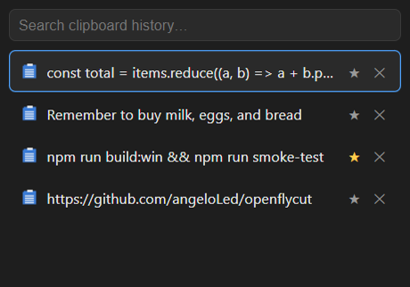
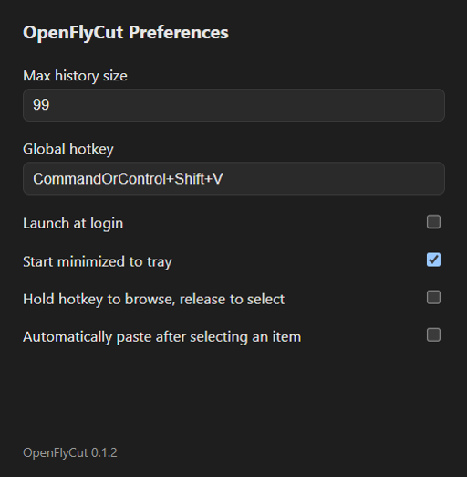

<div align="center">


# OpenFlyCut

</div>

[](LICENSE)
[](https://github.com/angeloLed/openflycut/releases/latest)
[](#building-an-installer)

An open-source, cross-platform clipboard history manager inspired by [Flycut](https://apps.apple.com/it/app/flycut-clipboard-manager/id442160987) for macOS. Built with Electron, React and TypeScript so it can run on Windows, macOS and Linux from a single codebase.

> Not affiliated with or endorsed by the original Flycut project or its authors.

This project was built through "vibe coding" with [Claude](https://claude.com/claude-code) — most of the code was written by the AI, with the maintainer directing features and reviewing changes rather than writing every line by hand.

**[⬇ Download the latest release](https://github.com/angeloLed/openflycut/releases/latest)** — Windows installer (`.exe`), Linux `AppImage`/`.deb`.





## Contents

- [What it's for](#what-its-for)
- [Features](#features-v1)
- [Development](#development)
- [Building an installer](#building-an-installer)
- [Docker (Linux build/test environment)](#docker-linux-buildtest-environment)
- [Smoke-testing a packaged build](#smoke-testing-a-packaged-build)
- [Icons](#icons)
- [Project layout](#project-layout)
- [License](#license)

## What it's for

Every time you copy something, it overwrites whatever you copied before — so the moment you need the URL from three copies ago, it's gone. OpenFlyCut keeps a running history (up to ~99 items, configurable) instead, so your clipboard works more like a short-term memory: hit the hotkey, find what you need, paste it. No more re-opening a tab just to re-copy something you already had.

It's one app, but it adapts to a few different ways of working through opt-in settings rather than forcing one workflow:

- **Default — press to toggle.** Open the popup, glance or type to filter, click or hit Enter. The natural fit for occasional "wait, what did I copy earlier" lookups.
- **Hold to browse.** For anyone who already lives in keyboard shortcuts: hold the hotkey's modifiers down, tap through history with the arrow keys, let go to pick — the same muscle memory as Alt-Tab, just for your clipboard.
- **Auto-paste on select.** Skip the manual `Ctrl+V` entirely — selecting an item pastes it straight into whatever you were doing. Built for repetitive work: filling the same fields over and over, pasting a template reply into many threads, that kind of thing.
- **Pinning.** Keep the handful of things you reach for constantly — a signature, a recurring SQL query, a boilerplate snippet — permanently available regardless of how much history piles up around them.
- **Launch at login + start minimized.** Set it up once; it lives quietly in the tray until the hotkey calls it.

## Features (v1)

- Silently tracks your clipboard text history (configurable size, default 99 items)
- Global hotkey (default `Ctrl+Shift+V`) opens a quick search/select popup near your cursor
- Optional "hold to browse" mode (Windows, off by default): keep the hotkey's modifiers held down to browse with the arrow keys, and releasing them selects whatever's highlighted
- The list is focused by default when the popup opens, so arrow keys and Enter work immediately — typing jumps into search
- Selecting an item merges it back to the top of the history and copies it to the clipboard — just press `Ctrl+V`
- On Windows, focus returns to whatever app you were in before opening the popup, so `Ctrl+V` works immediately with no need to click back into it
- Optional "auto-paste on select" (Windows, off by default): simulates `Ctrl+V` in that app for you, right after selecting an item
- Shows the icon of the app each item was copied from (Windows)
- Pin/star favorite items so they're never evicted
- Delete individual items or clear the whole (unpinned) history
- Runs from the system tray with Preferences for history size, hotkey, launch at login and start-minimized
- History and settings persist locally between restarts — no account, no cloud

Out of scope for v1: images/rich text clipboard content, cloud sync, auto-update.

## Development

Requires [Node.js](https://nodejs.org) (LTS).

```bash
npm install
npm run dev
```

```bash
npm run typecheck
```

## Building an installer

```bash
npm run build:win     # Windows NSIS installer
npm run build:mac     # macOS dmg/zip (requires a real build/icon.icns, see below)
npm run build:linux   # Linux AppImage/deb
```

Unsigned local builds will show an "Unknown publisher" warning on Windows (SmartScreen) — this is expected until the project is code-signed.

The renderer bundle is minified and `build/afterPack.js` strips Electron's bundled locale files down to English-only (the UI isn't translated), which together cut the packaged size by roughly 10-30% depending on platform/compression. If you add real i18n later, update `KEEP_LOCALES` in that script.

Want to publish a build as a GitHub Release? See `.cursor/skills/github-release/SKILL.md` for the full `npm run release:*` flow (builds, tags, and uploads via the `gh` CLI).

## Docker (Linux build/test environment)

The project has two build lanes: **native on Windows**, **Docker on Linux**. `Dockerfile` gives a reproducible Ubuntu environment with Node.js, Electron's GTK/X11 runtime libraries, and the extra tools `electron-builder`'s `.deb` target needs — the exact set of packages this project actually needed when the Linux build was verified by hand, not a generic guess. It doesn't attempt to run the Electron GUI interactively; it's for building and headlessly smoke-testing (and, as it turns out, screenshotting) the Linux target reproducibly, so nobody has to rediscover the apt package list.

There's deliberately no equivalent Windows container: Docker Desktop can only run one engine at a time (Linux *or* Windows containers, not both), a matching Windows Server Core base image is heavyweight and version-fussy, and even then there's no headless-display story for smoke-testing the GUI the way `Xvfb` gives us on Linux — so it wouldn't actually buy reproducible testing, only a more fragile build. Build the Windows installer natively (`npm run build:win`) as usual; `docker-compose.yml`'s `linux` service just makes the Ubuntu side an equally short command, not a literal mirror of it:

```bash
docker compose build linux

# typecheck / build / package — mounted into the repo, so results land in your own release/ and out/
docker compose run --rm linux npm run typecheck
docker compose run --rm linux npm run build:linux

# functional smoke test of the packaged app, headless via Xvfb
docker compose run --rm linux xvfb-run -a npm run smoke-test
```

`docker-compose.yml` keeps the container's own Linux-native `node_modules` (with `electron`/`koffi`'s Linux prebuilt binaries) in a named volume, separate from whatever `node_modules` exists on the host — this works the same whether you're on Windows, macOS or Linux; only the container needs Docker, not a matching Node/Electron setup on the host. The `Dockerfile` also installs `tini` as PID 1 (`ENTRYPOINT`) — without it, Electron hangs on shutdown inside a container (no init process to reap Chromium's child processes), which silently hangs anything waiting on it to exit, `smoke-test.mjs` included.

## Smoke-testing a packaged build

`scripts/smoke-test.mjs` drives a **packaged** build (`release/win-unpacked` or `release/linux-unpacked`, from `npm run build:win` / `build:linux`) via Playwright's Electron driver: confirms the app boots tray-only with no window, opens the real popup bundle, and round-trips an actual OS clipboard write through the watcher into the UI. Run it after any packaging-related change, on both platforms:

```bash
npm run build:win && npm run smoke-test        # Windows
npm run build:linux && xvfb-run -a npm run smoke-test   # Linux / inside Docker
```

## Icons

`scripts/generate-icons.mjs` generates `build/icon.ico` and `build/icon.png` (also copied to `resources/`, which is what the app actually loads at runtime) from a small procedurally-drawn glyph, using pure-JS libraries (`jimp`, `png-to-ico`) so no native/Xcode/Visual Studio toolchain is required:

```bash
npm run generate-icons
```

A proper `build/icon.icns` for macOS packaging is **not** generated by this script (there's no reliable pure-JS `.icns` encoder available on Windows) — a macOS contributor should generate one (e.g. via `iconutil`) before running `npm run build:mac`, or swap in a package like `png2icons` which supports `.icns` from a single PNG.

## Project layout

```
src/
  shared/     # types + IPC channel contract shared between main and renderer
  main/       # Electron main process: tray, windows, clipboard watcher, stores, IPC
  preload/    # contextBridge API exposed to the renderer as window.api
  renderer/   # React UI: the history popup and the Preferences window
scripts/
  generate-icons.mjs
  smoke-test.mjs
  release.mjs
```

## License

MIT — see [LICENSE](LICENSE).
